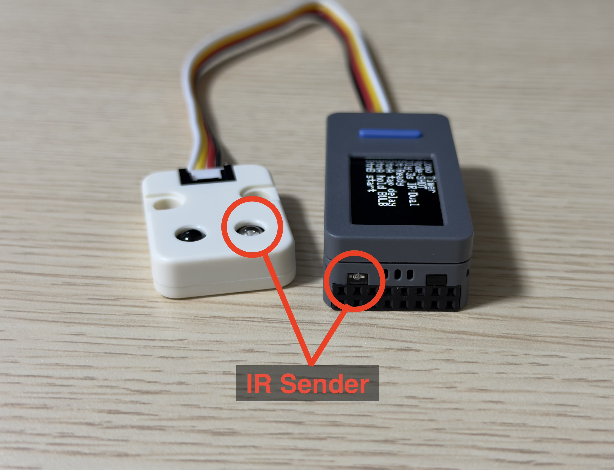

# Lomo C/R: Lomo'Instant Wide Glass セルフタイマー & リモート

[English](README.md) | [简体中文](README.zh-CN.md) | [日本語](README.ja.md)

**M5StickS3** をベースにした、**Lomo'Instant Wide Glass** 向けのすぐに使えるバッテリー内蔵の赤外線セルフタイマー・リモートです。

## ハードウェア

外付けの **U002 IR 送信モジュール** は任意です。M5StickS3 本体だけでもカメラへ IR 信号を送れます。U002 を追加すると、出力が強くなり、設置位置の自由度も上がります。

## IR 受光部の位置

カメラは前面・背面どちらの IR 受光部でもトリガーできます。

## クイックスタート

1. [Arduino IDE 2.x](https://www.arduino.cc/en/software) をインストールします。
2. `M5Stack` ボードパッケージをインストールし、`M5StickS3` を選択します。
3. ライブラリマネージャーから `M5Unified` ライブラリをインストールします。
4. `firmware/self_timer/self_timer.ino` を開き、デバイスに書き込みます。
5. StickS3 本体、または任意の U002 IR 送信モジュールを、カメラの赤外線受光部に向けます（最適距離は約 40cm です）。
6. **操作方法:**
   - **正面の青いバー型ボタン (`Front Btn`):** クリックでタイマー/露光時間を切り替えます。長押しで **Shot モード** と **Bulb モード** を切り替えます。
   - **側面の大きい長方形ボタン (`Side Btn`):** カウントダウンの開始/キャンセル、または Bulb 露光の終了に使います。
   - **側面の小さいボタン:** 電源操作専用で、セルフタイマー UI では使いません。
   - タイトル行にバッテリー残量が表示され、`+` は充電中を示します。

## バルブ撮影 (Bulb Mode) に関する注意

アナログインスタントフィルムおよびLomoのメカニカルシャッターの性質上、バルブモードにおいてマイクロ秒単位の精度は不要であり、実現も困難です：

- **Instax フィルムの化学的特性**: Instax Wide フィルム (ISO 800) はアナログの化学メディアです。数秒にわたる長時間露光では、0.1秒の差 (例: 4.1秒と4.2秒) が写真の仕上がりに影響を与えることはありません。
- **相反則不軌 (Reciprocity Failure)**: 長時間露光時にフィルムの感度が低下する現象です。露光が1〜2秒を超えると、光量を1段増やすためには露光時間を倍にする必要があります。そのため、微小な時間調整には意味がありません。
- **メカニカルラグ**: Lomo'Instant Wide Glass は、Arduino(赤外線信号)からの信号でトリガーされるメカニカルなレンズシャッターを備えています。これには機械的な遅延が伴います。Arduinoが正確に2.1秒間信号を送信したとしても、シャッターの羽根が物理的にきっちり2.100秒間開閉するわけではありません。

## 実験と詳細 (Experiments & Deep Dive)

Lomo の赤外線プロトコルをどのようにデコードし、リバースエンジニアリングして検証したかについて興味がある方は、[docs/](docs/) ディレクトリをご覧ください。他のカメラの信号を学習したい場合は、`firmware/ir_capture/ir_capture.ino` を使ってリモコン信号をキャプチャできます。メインの README は意図的に短くしています。このリポジトリのコードはすでに「すぐに使える」状態です。
