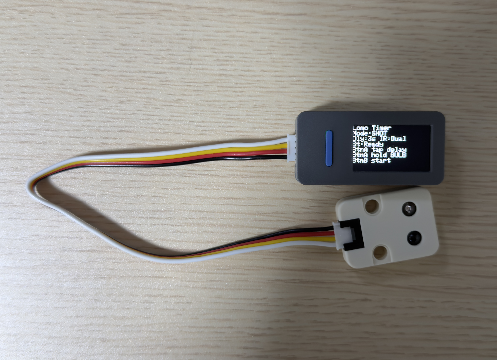
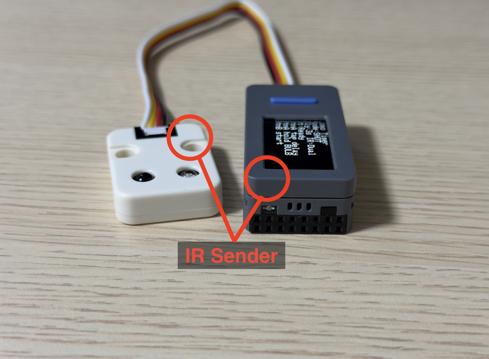
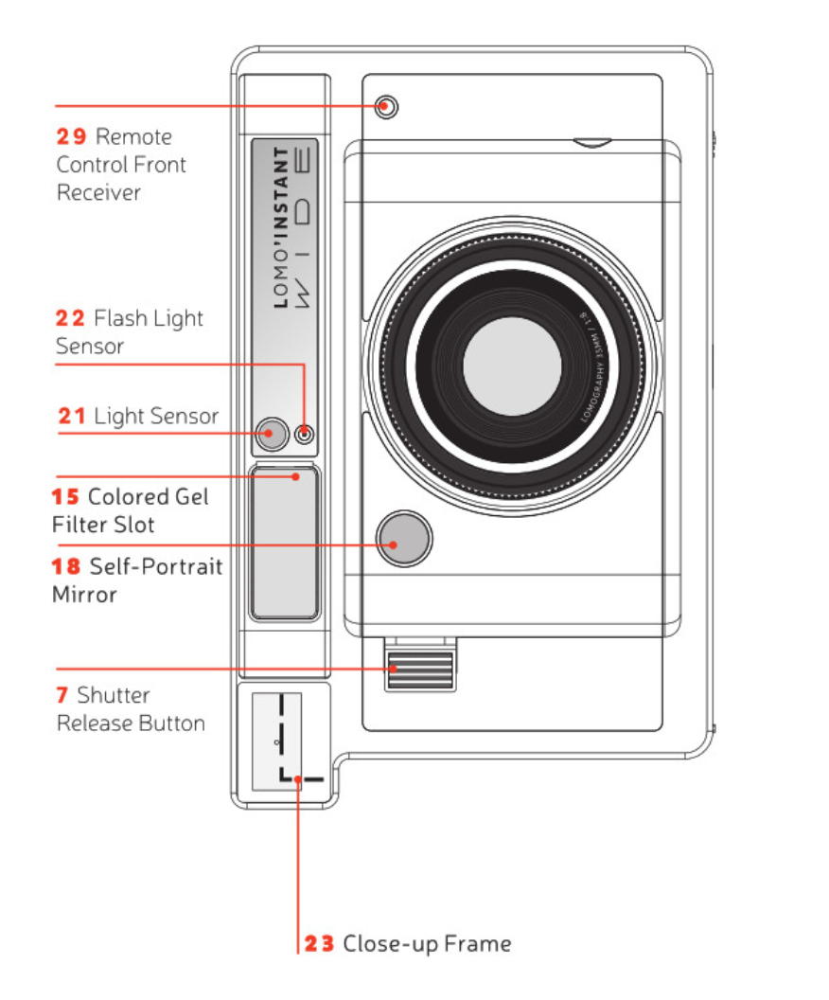
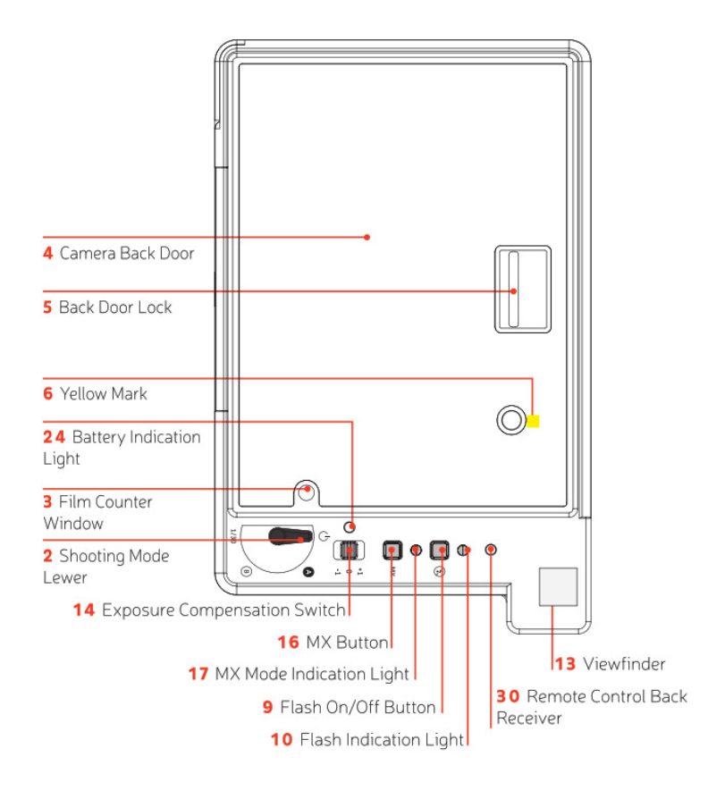

# Lomo C/R: Lomo'Instant Wide Glass 自拍与遥控器

[English](README.md) | [简体中文](README.zh-CN.md) | [日本語](README.ja.md)

基于 **M5StickS3** 打造的 **Lomo'Instant Wide Glass** 红外自拍和遥控器。开箱即用，内置电池供电。

## 硬件

定时器主机通过外置 IR 发射模块向相机发送信号。

## IR 接收器位置

相机前后两侧的 IR 接收器都可以接收触发信号。

## 快速开始

1. 安装 [Arduino IDE 2.x](https://www.arduino.cc/en/software)。
2. 安装 `M5Stack` 开发板支持包，并选择 `M5StickS3`。
3. 在库管理器中安装 `M5Unified` 库。
4. 打开并上传 `firmware/self_timer/self_timer.ino` 到你的设备。
5. 将 StickS3 对准相机正面的红外接收器（最佳距离约 40cm 内）。
6. **操作说明:**
   - **BtnB (正面/M5键):** 开始/取消倒计时。
   - **BtnA (侧边键):** 单击切换倒计时/曝光时间。长按切换 **Shot (单拍) 模式** 和 **Bulb (B门) 模式**。

## Bulb (B门) 模式须知

由于模拟拍立得相机的物理特性，B门模式下追求微秒级的精准控制既不现实也无必要：

- **Instax 相纸化学特性**：你使用的是 Instax Wide 相纸 (ISO 800)。这是一种基于化学反应的模拟媒介。在数秒的长曝光中，0.1秒的差异（例如 4.1秒 和 4.2秒）在成品上是完全不可见的。
- **倒易律失效 (Reciprocity Failure)**：倒易律失效意味着在长曝光下相纸会损失感光度。一旦曝光时间超过1到2秒，你通常需要让曝光时间翻倍才能增加一档曝光量。因此微小的曝光时间调整毫无意义。
- **机械延迟 (Mechanical Lag)**：Lomo'Instant Wide Glass 使用由 Arduino (红外信号) 触发的机械镜间快门，存在固有的机械延迟。Arduino 发出精确2.1秒的信号，并不意味着物理快门叶片会经历精确 2.100 秒的开合。

## 实验记录与技术深度解析

如果你对如何抓取、逆向工程和验证 Lomo 的红外协议感兴趣，请参阅 [docs/](docs/) 目录。主 README 刻意保持简短——本仓库的代码已经是开箱即用的成品状态！
